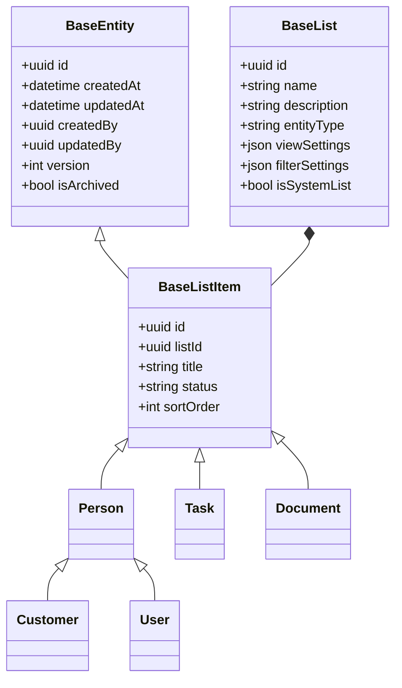
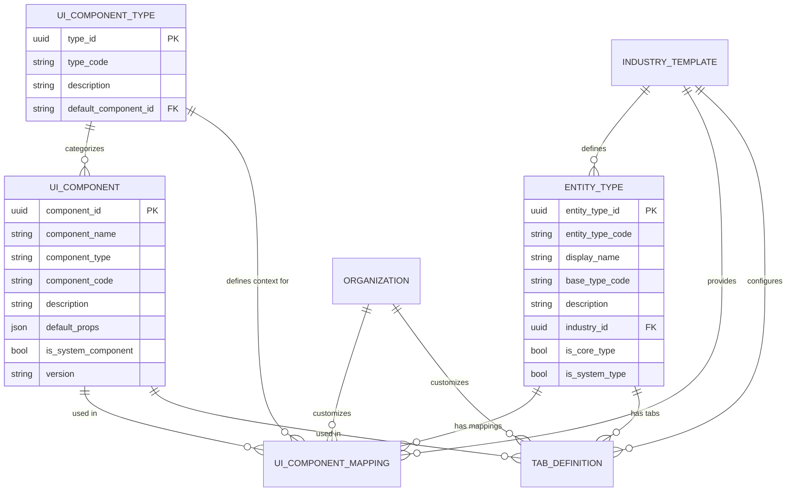

# Atavya Architecture Summary

## Overview
This document provides a comprehensive summary of the Atavya platform architecture based on the documentation in `docs/architecture`. It serves as a reference for all development work within the AI Documentation Framework.

## Industry-Customizable Architecture

Atavya is designed as a flexible platform that can be customized for different industries while maintaining a consistent core architecture. The architecture follows a layered approach:

### Layer 1: Core Platform
- **Base Entity Framework**: Common entity types and behaviors
  - BaseEntity: Common properties for all entities
  - BaseList: Management of collections
  - BaseListItem: Common behaviors for list items
  - Person: Base type for all person-related entities
- **Core Services**: Platform-wide services
  - Authentication
  - Authorization
  - Messaging
  - Workflow Engine
  - Notification System
  - File Management
  - Custom Fields Engine
  - Search Service
- **UI Component Registry**: Component management system
  - Component Registry Service
  - Default UI Components
  - UI Mapping Rules
  - UI Composition Engine

### Layer 2: Industry Templates
- Pre-configured sets of entities, fields, workflows, and UI components
- Industry-specific entity types and behaviors
- Specialized UI components for industry needs
- Industry-specific workflows and business rules
- Template Registry Service for managing templates

### Layer 3: Organization Layer
- Organization-specific customizations
- Custom entity types
- Custom UI mappings
- Custom workflows
- Organization settings and preferences

### Layer 4: Implementation Layer
- Deployed instances for specific clients
- Client-specific data and configurations
- Client-specific integrations
- Client-specific customizations

## UI Component Registry System

The UI Component Registry is a central part of Atavya's extensibility system, allowing industry-specific and custom UI components to be mapped to different entity types.

### Core Entities
- **UI_COMPONENT**: Defines a UI component
- **UI_COMPONENT_TYPE**: Categorizes components by type
- **ENTITY_TYPE**: Defines entity types in the system
- **INDUSTRY_TEMPLATE**: Defines industry templates
- **ORGANIZATION**: Represents client organizations
- **UI_COMPONENT_MAPPING**: Maps components to entity types
- **TAB_DEFINITION**: Defines tabs for entity details

### Component Types
- LIST_VIEW: Component for displaying entity lists
- DETAIL_VIEW: Component for entity detail views
- FORM_VIEW: Component for create/edit forms
- MAIN_TAB: Component for the main tab content
- CUSTOM_TAB: Component for custom/specialized tabs
- DASHBOARD_WIDGET: Component for dashboard widgets
- LIST_ITEM: Component for rendering list items
- CARD_VIEW: Component for card-based displays
- CALENDAR_VIEW: Component for calendar-based displays
- KANBAN_VIEW: Component for kanban-style boards

### Component Resolution Logic
The system resolves which UI component to use for a given entity type using this priority order:
1. Organization-specific mapping for the entity type
2. Industry-specific mapping for the entity type
3. Default mapping for the entity type
4. Default mapping for the base entity type
5. System default component for the component type

## Entity Relationships

## UI Component Registry Relationships

## Implementation Guidelines

### Creating Industry-Specific Components
1. Define industry-specific entity types that extend base entity types
2. Create UI components for industry-specific entity types
3. Register components in the UI Component Registry
4. Create UI component mappings for industry-specific entity types
5. Define tab configurations for industry-specific entity details

### Extending Core Components
1. Identify extension points in core components
2. Create industry-specific components that extend core components
3. Register industry-specific components in the UI Component Registry
4. Create UI component mappings that override default mappings
5. Ensure industry-specific components maintain compatibility with core functionality

### Organization-Specific Customizations
1. Create organization-specific UI component mappings
2. Define organization-specific entity types
3. Create organization-specific workflows
4. Configure organization settings
5. Ensure customizations follow platform guidelines

## Application to HVAC Industry

The HVAC industry implementation follows this architecture by:
1. Defining HVAC-specific entity types (ServiceJob, Technician, Equipment, etc.)
2. Creating UI components for HVAC-specific entity types
3. Registering components in the UI Component Registry
4. Creating UI component mappings for HVAC entity types
5. Extending core components with HVAC-specific functionality

## References
- [Industry-Customizable Architecture](../../docs/architecture/industry-customizable-architecture.md)
- [Component Library Architecture](../../docs/architecture/component-library-architecture.md)
- [UI Component Registry Model](../../docs/data-models/ui-component-registry-model.md)
