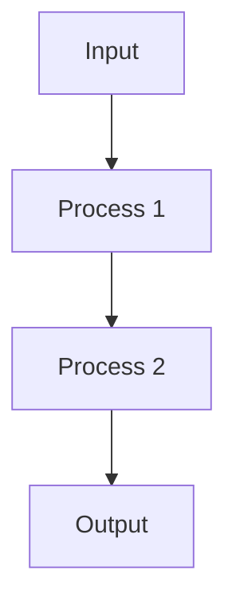

# Design Document: [Component Name]

## Overview
[Brief description of the component and its purpose]

## Requirements Reference
[Link to the requirements document this design is based on]

## Component Architecture

### Component Structure
```
[Component]
├── [Subcomponent 1]
│   ├── [Element 1.1]
│   └── [Element 1.2]
└── [Subcomponent 2]
    ├── [Element 2.1]
    └── [Element 2.2]
```

### Key Components
- **[Component 1]**: [Description and responsibility]
- **[Component 2]**: [Description and responsibility]
- **[Component 3]**: [Description and responsibility]

### Interfaces
```typescript
interface [InterfaceName] {
  [property]: [type];
  [method]([parameters]): [returnType];
}
```

### Data Flow
[Description of how data flows through the component]



## Technical Decisions

### Decision 1: [Decision Title]
- **Context**: [What is the context of this decision?]
- **Options Considered**:
  - **Option 1**: [Description]
  - **Option 2**: [Description]
  - **Option 3**: [Description]
- **Decision**: [Which option was chosen]
- **Rationale**: [Why this option was chosen]
- **Consequences**: [What are the consequences of this decision]

### Decision 2: [Decision Title]
- **Context**: [What is the context of this decision?]
- **Options Considered**:
  - **Option 1**: [Description]
  - **Option 2**: [Description]
  - **Option 3**: [Description]
- **Decision**: [Which option was chosen]
- **Rationale**: [Why this option was chosen]
- **Consequences**: [What are the consequences of this decision]

## Architectural Alignment
[Description of how this design aligns with the overall architecture]

### Extension Points
[Description of how this component can be extended]

### Integration with Existing Components
[Description of how this component integrates with existing components]

## Performance Considerations
[Description of performance considerations]

## Accessibility Considerations
[Description of accessibility considerations]

## Security Considerations
[Description of security considerations]

## Testing Approach
[Description of how this component will be tested]

### Unit Testing
[Description of unit testing approach]

### Integration Testing
[Description of integration testing approach]

### End-to-End Testing
[Description of end-to-end testing approach]

## Implementation Plan
[High-level implementation plan]

## Open Questions
[List of open questions that need to be resolved]

## References
- [Reference 1]: [Description]
- [Reference 2]: [Description]
- [Reference 3]: [Description]
