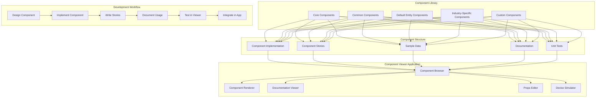
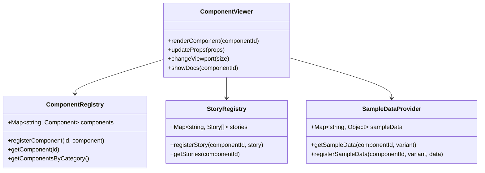

# Atavya Component Library Architecture

## Overview

The Atavya Component Library and Viewer Application provide a structured approach to UI component development, documentation, and testing. This architecture enables developers to build, test, and showcase components in isolation, ensuring consistency and reusability across the platform.



## Component Library Structure

The Component Library follows a hierarchical structure:

1. **Core Components**: Fundamental UI building blocks like Button, Input, Select, Card
2. **Common Components**: Reusable components used across entities like EntityHeader, CommunicationTab
3. **Default Entity Components**: Standard implementations for entity views
4. **Industry-Specific Components**: Specialized components for different industries
5. **Custom Components**: Organization-specific customizations

## Component Viewer Application

The Component Viewer is built using Storybook.js and provides:

1. **Component Browser**: Categorized list of all available components
2. **Component Renderer**: Displays components with various props and states
3. **Documentation Viewer**: Shows component documentation and usage examples
4. **Props Editor**: Interactive controls to modify component props
5. **Device Simulator**: Tests components in different viewport sizes



## Component Documentation Format

Each component is documented using a standardized format:

1. **Overview**: Brief description of the component's purpose
2. **Props**: Detailed explanation of all props with types and defaults
3. **Examples**: Common usage patterns
4. **Best Practices**: Guidelines for component usage
5. **Related Components**: Links to related or alternative components

Documentation is written in Markdown and rendered in the Component Viewer.

## Component Story Structure

Stories are defined using the Storybook.js format:

```javascript
export default {
  title: 'Category/ComponentName',
  component: ComponentName,
  parameters: { /* ... */ },
  argTypes: { /* ... */ }
};

// Default example
export const Default = (args) => <ComponentName {...args} />;
Default.args = { /* default props */ };

// Variants
export const Variant1 = (args) => <ComponentName {...args} />;
Variant1.args = { /* variant props */ };
```

## Sample Data Management

Sample data for components is organized by entity type and scenario:

1. **Generic data**: Basic examples for simple components
2. **Entity-specific data**: Data that matches entity structures
3. **Industry-specific data**: Specialized data for industry components
4. **Edge cases**: Data that tests component limitations and error states

## Integration with Main Application

The Component Library integrates with the main application in several ways:

1. **Shared component imports**: Both applications import from the same component source
2. **Live component updates**: Changes to components are immediately reflected in the viewer
3. **Documentation extraction**: Component documentation is extracted from JSDoc comments
4. **Test integration**: Component tests can be run from the viewer

## Development Workflow

1. **Design Component**: Define requirements and interface
2. **Implement Component**: Create the component and styles
3. **Write Stories**: Define examples and variants
4. **Document Usage**: Add comprehensive documentation
5. **Test in Viewer**: Validate behavior in isolation
6. **Integrate in App**: Use the component in the main application

This workflow ensures that components are well-tested and documented before being used in the application.

## Technical Implementation

The Component Viewer is implemented as a separate application using:

1. **Storybook.js**: For component visualization and documentation
2. **React**: For the component library itself
3. **TypeScript**: For type definitions and prop validation
4. **CSS Modules or Tailwind CSS**: For styling components
5. **Jest & React Testing Library**: For component testing

## Deployment

The Component Viewer is deployed as:

1. **Development environment**: Local server for component development
2. **Shared environment**: Deployed version for team reference
3. **Documentation site**: Public-facing component documentation

Each deployment updates automatically when components are changed.