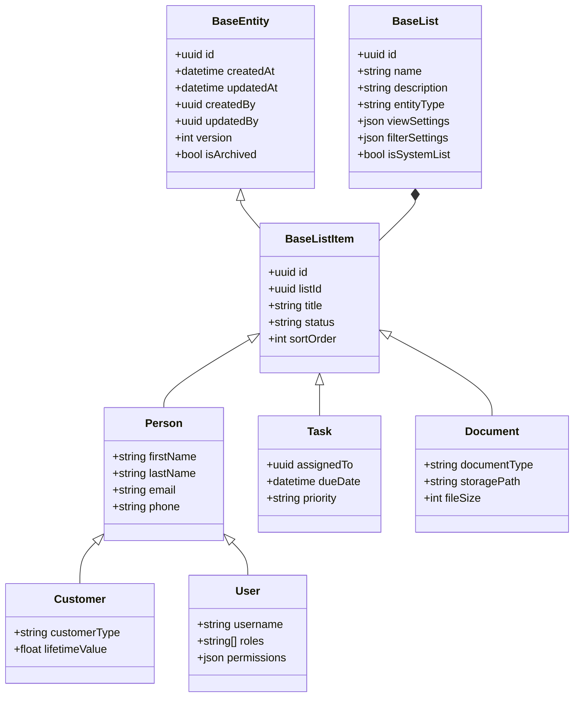
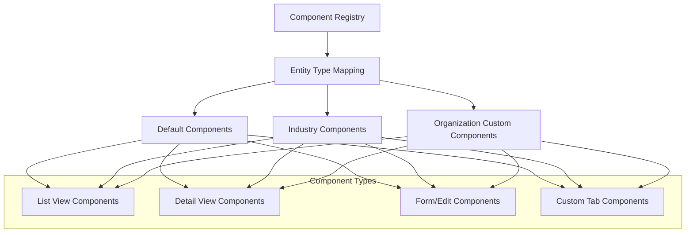
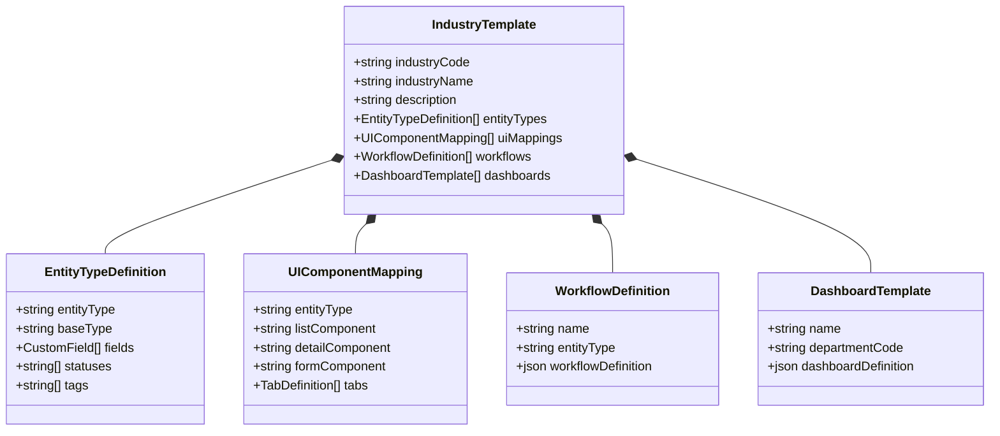
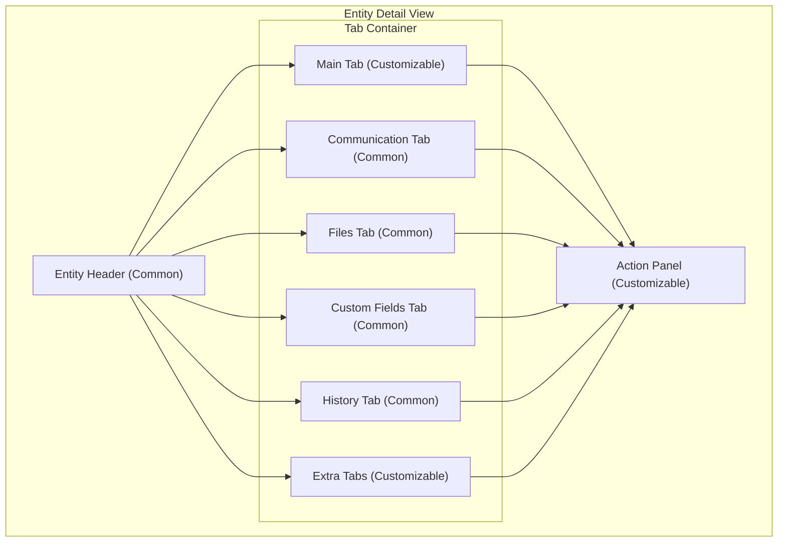

# Atavya - Industry-Customizable Architecture

## Overview

Atavya is designed as a flexible platform that can be customized for different industries while maintaining a consistent core architecture. This document outlines the architectural approach for supporting industry-specific customizations.

```mermaid
flowchart TB
    subgraph "Core Platform"
        subgraph "Base Entity Framework"
            BE["BaseEntity"]
            BL["BaseList"]
            BLI["BaseListItem"]
            Person["Person"]
        end
        
        subgraph "Core Services"
            CS1["Authentication"]
            CS2["Authorization"]
            CS3["Messaging"]
            CS4["Workflow Engine"]
            CS5["Notification System"]
            CS6["File Management"]
            CS7["Custom Fields Engine"]
            CS8["Search Service"]
        end
        
        subgraph "UI Component Registry"
            UI1["Component Registry Service"]
            UI2["Default UI Components"]
            UI3["UI Mapping Rules"]
            UI4["UI Composition Engine"]
        end
    end
    
    subgraph "Industry Templates"
        IT1["HVAC Industry Template"]
        IT2["Property Management Template"]
        IT3["Professional Services Template"]
        IT4["Template Registry Service"]
    end
    
    subgraph "Organization Layer"
        OL1["Organization Settings"]
        OL2["Custom Entity Types"]
        OL3["Custom UI Mappings"]
        OL4["Custom Workflows"]
    end
    
    subgraph "Implementation Layer"
        IL1["HVAC Organization"]
        IL2["Property Management Organization"]
        IL3["Professional Services Organization"]
    end
    
    Core Platform --> Industry Templates
    Industry Templates --> Organization Layer
    Organization Layer --> Implementation Layer
```

## Architectural Principles

1. **Core Platform**: Provides base functionality used by all industries
2. **Industry Templates**: Pre-configured sets of entities, fields, workflows, and UI components
3. **Organization Layer**: Customization layer for specific client implementations
4. **Implementation Layer**: Actual deployed instances for each client

## Component Architecture

### 1. Base Entity Framework

The foundation of the platform is a consistent entity model:



### 2. UI Component Registry

The UI Component Registry system enables flexible UI mapping to entity types:



The registry follows these rules:
1. Default components are used unless overridden
2. Industry components override default components
3. Organization custom components override industry components
4. Component resolution is done at runtime based on entity type

### 3. Industry Template System

Industry templates provide pre-configured settings:



### 4. Customizable UI Structure

All entity detail views follow a consistent structure that allows for customization:



The Main Tab content is the primary area for industry-specific customization, while maintaining consistent UI patterns for common functionality.

## Implementation Process

When implementing Atavya for a specific organization:

1. **Select Industry Template**: Choose the appropriate industry template
2. **Configure Organization**: Set up organization settings, users, and permissions
3. **Customize Entity Types**: Modify or extend entity types as needed
4. **Define Custom UI Mappings**: Override UI components if required
5. **Configure Workflows**: Set up or modify workflow definitions
6. **Import Initial Data**: Populate the system with organization data
7. **Deploy & Train**: Deploy the customized instance and train users

This architecture allows for rapid deployment of industry-specific solutions while maintaining a consistent core platform.