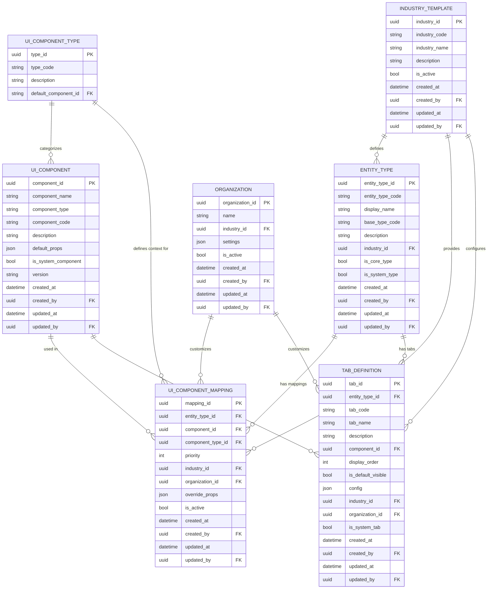

# UI Component Registry Data Model

The UI Component Registry is a central part of Atavya's extensibility system, allowing industry-specific and custom UI components to be mapped to different entity types. This enables the platform to display specialized interfaces for particular industries while maintaining a consistent core experience.

## Core Entities

## Component Types

The `UI_COMPONENT_TYPE` table would contain records for the following component types:

| type_code | description |
|-----------|-------------|
| LIST_VIEW | Component for displaying entity lists |
| DETAIL_VIEW | Component for entity detail views |
| FORM_VIEW | Component for create/edit forms |
| MAIN_TAB | Component for the main tab content |
| CUSTOM_TAB | Component for custom/specialized tabs |
| DASHBOARD_WIDGET | Component for dashboard widgets |
| LIST_ITEM | Component for rendering list items |
| CARD_VIEW | Component for card-based displays |
| CALENDAR_VIEW | Component for calendar-based displays |
| KANBAN_VIEW | Component for kanban-style boards |

## Component Resolution Logic

The system resolves which UI component to use for a given entity type using this priority order:

1. Organization-specific mapping for the entity type
2. Industry-specific mapping for the entity type
3. Default mapping for the entity type
4. Default mapping for the base entity type
5. System default component for the component type

This resolution happens at runtime, allowing for flexible customization without code changes.

## Example UI Component Mappings

### Core Platform Default Mappings

| entity_type_code | component_type | component_code | industry_code | organization_id |
|------------------|----------------|---------------|---------------|-----------------|
| TASK | LIST_VIEW | DefaultTaskList | NULL | NULL |
| TASK | DETAIL_VIEW | DefaultTaskDetail | NULL | NULL |
| TASK | FORM_VIEW | DefaultTaskForm | NULL | NULL |
| CUSTOMER | LIST_VIEW | DefaultCustomerList | NULL | NULL |
| CUSTOMER | DETAIL_VIEW | DefaultCustomerDetail | NULL | NULL |
| CUSTOMER | FORM_VIEW | DefaultCustomerForm | NULL | NULL |

### HVAC Industry Mappings

| entity_type_code | component_type | component_code | industry_code | organization_id |
|------------------|----------------|---------------|---------------|-----------------|
| SERVICE_JOB | LIST_VIEW | HvacServiceJobList | HVAC | NULL |
| SERVICE_JOB | DETAIL_VIEW | HvacServiceJobDetail | HVAC | NULL |
| SERVICE_JOB | FORM_VIEW | HvacServiceJobForm | HVAC | NULL |
| TECHNICIAN | DETAIL_VIEW | HvacTechnicianDetail | HVAC | NULL |
| EQUIPMENT | DETAIL_VIEW | HvacEquipmentDetail | HVAC | NULL |

### Property Management Industry Mappings

| entity_type_code | component_type | component_code | industry_code | organization_id |
|------------------|----------------|---------------|---------------|-----------------|
| PROPERTY | LIST_VIEW | PropertyList | PROPERTY_MGMT | NULL |
| PROPERTY | DETAIL_VIEW | PropertyDetail | PROPERTY_MGMT | NULL |
| LEASE | DETAIL_VIEW | LeaseDetail | PROPERTY_MGMT | NULL |
| TENANT | DETAIL_VIEW | TenantDetail | PROPERTY_MGMT | NULL |
| MAINTENANCE_REQUEST | DETAIL_VIEW | MaintenanceRequestDetail | PROPERTY_MGMT | NULL |

### Organization-Specific Mappings

| entity_type_code | component_type | component_code | industry_code | organization_id |
|------------------|----------------|---------------|---------------|-----------------|
| SERVICE_JOB | DETAIL_VIEW | CustomHvacJobDetail | HVAC | org-123 |
| CUSTOMER | FORM_VIEW | CustomCustomerForm | HVAC | org-123 |

## Tab Definitions

Tabs provide another level of customization for entity details. Each entity type can have a different set of tabs, and the tab content can be customized.

### Default Core Tabs

| entity_type_code | tab_code | tab_name | component_code | display_order | is_system_tab |
|------------------|----------|----------|---------------|--------------|---------------|
| * | MAIN | Details | DefaultMainTab | 1 | true |
| * | COMMUNICATION | Messages | CommunicationTab | 2 | true |
| * | FILES | Files | AttachmentsTab | 3 | true |
| * | CUSTOM_FIELDS | Custom Fields | CustomFieldsTab | 4 | true |
| * | HISTORY | History | HistoryTab | 5 | true |

### Industry-Specific Tabs

| entity_type_code | tab_code | tab_name | component_code | industry_code | display_order |
|------------------|----------|----------|---------------|--------------|---------------|
| SERVICE_JOB | EQUIPMENT | Equipment | HvacEquipmentTab | HVAC | 6 |
| SERVICE_JOB | PARTS | Parts & Materials | HvacPartsTab | HVAC | 7 |
| PROPERTY | UNITS | Units | PropertyUnitsTab | PROPERTY_MGMT | 6 |
| PROPERTY | FINANCES | Financial Summary | PropertyFinancesTab | PROPERTY_MGMT | 7 |

By using this component registry system, Atavya can provide industry-specific and customized user interfaces while maintaining a consistent core architecture and user experience.